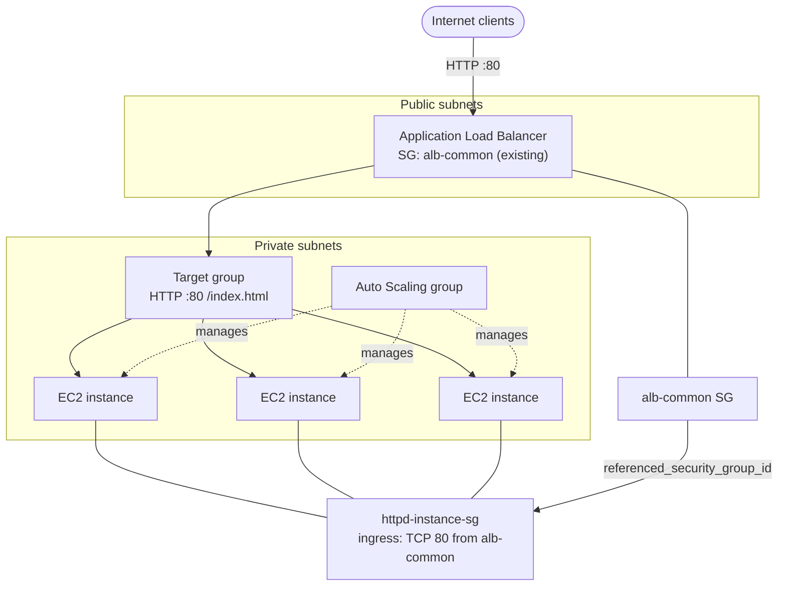

# AWS Auto Scaling Stack

Terraform configuration that provisions a horizontally scalable Apache HTTPD fleet behind an Application Load Balancer (ALB). EC2 instances run in private subnets; the ALB sits in public subnets and uses a shared, pre-existing security group.

## What gets created

| Resource | Purpose |
|----------|---------|
| `aws_launch_template.httpd_launch_template` | Instance blueprint: AMI, type, EBS, IAM profile, SSH key, user data, instance SG |
| `aws_autoscaling_group.httpd_autoscaling_group` | Manages instance count, registers instances with the target group, rolling refresh |
| `aws_lb.httpd_alb` | Internet-facing ALB on HTTP port 80 |
| `aws_lb_target_group.httpd_target_group` | Routes ALB traffic to instances on port 80; health checks `/index.html` |
| `aws_lb_listener.httpd_listener` | Forwards port 80 traffic to the target group |
| `aws_security_group.httpd_instance_sg` | Instance-level firewall; only allows HTTP from the ALB |
| `aws_key_pair.ssh_key` | SSH access to instances (for break-glass / debugging) |

## What is referenced (not created)

These resources must already exist in the target account:

| Data source | Lookup |
|-------------|--------|
| `data.aws_vpc.selected` | VPC tagged `Name = rosa_public` |
| `data.aws_security_group.selected` | Security group tagged `Name = alb-common` (used by the ALB) |
| `data.aws_iam_role.selected` | IAM role `ec2-system-manager-instance-role` |
| `data.aws_ami.centos` | Latest CentOS Stream 9 x86_64 AMI |

## Architecture



On first boot, `userdata/common.sh` installs Apache (`httpd`), configures `firewalld`, deploys a simple `index.html`, and enables the SSM agent.

## How `referenced_security_group_id` works

The instance security group does **not** open port 80 to the internet. Instead, ingress is restricted to traffic that originates from the ALB security group.

```hcl
resource "aws_vpc_security_group_ingress_rule" "httpd_instance_80_sg" {
  security_group_id            = aws_security_group.httpd_instance_sg.id
  referenced_security_group_id = data.aws_security_group.selected.id   # alb-common
  from_port                    = 80
  to_port                      = 80
  ip_protocol                  = "tcp"
}
```

### What it does

`referenced_security_group_id` is the **source** security group for an ingress rule. AWS translates this into a rule of the form:

> Allow inbound TCP 80 on `httpd-instance-sg` **only when the source is a network interface that has `alb-common` attached**.

That is a **security-group-to-security-group** rule, as opposed to a CIDR rule (`cidr_ipv4 = "0.0.0.0/0"`).

### Why use it instead of CIDR?

| Approach | Behaviour |
|----------|-----------|
| `cidr_ipv4 = "0.0.0.0/0"` on instance SG | Any host on the internet could reach instance port 80 if routing allowed it — too broad for private workloads. |
| `referenced_security_group_id` | Only ENIs (elastic network interfaces) that belong to resources using the referenced SG can connect. Here, that means the ALB nodes forwarding traffic to backends. |

This is the standard pattern for ALB → EC2: instances accept application traffic only from the load balancer, not directly from clients.

### How the two security groups connect

1. **ALB** — `aws_lb.httpd_alb` is assigned `data.aws_security_group.selected.id` (`alb-common`). That SG controls what can reach the ALB itself (typically HTTP/HTTPS from the internet or corporate CIDRs, configured outside this repo).

2. **Instances** — `aws_launch_template.httpd_launch_template` attaches `aws_security_group.httpd_instance_sg`. The ingress rule above permits TCP 80 **from** `alb-common`.

3. **Traffic path** — Client → ALB (alb-common SG) → instance private IP (httpd-instance-sg allows because source SG matches).

No rule is required on the instance SG for the ALB’s IP addresses: AWS evaluates the **source security group** of the connection, not individual ALB IPs (which can change as ALB nodes scale).

### Egress

Instance egress is open to the internet (`cidr_ipv4 = "0.0.0.0/0`, all protocols) so instances can reach package mirrors, SSM endpoints, and other outbound dependencies. Tighten this in production if your VPC uses interface endpoints or a restricted egress path.

## Variables

Configure via `vars.auto.tfvars` or `-var` / `TF_VAR_*`:

| Variable | Description |
|----------|-------------|
| `base_name` | Prefix for resource names (e.g. `httpd`) |
| `region` | AWS region |
| `private_aws_subnet_ids` | Subnets for ASG instances |
| `public_aws_subnet_ids` | Subnets for the ALB |
| `instance_type` | EC2 instance type for the launch template |
| `asg_instance_ssh_key` | Path to local `.pub` file for the EC2 key pair |
| `ebs_disk` | Map with `size` and `type` (e.g. `gp3`) |
| `instance_count` | Map with `min`, `max`, `desired` for the ASG |
| `common_tags` | List of tag objects with `key`, `value`, `propagate_at_launch` |

## Usage

```bash
# Initialise providers (first run)
terraform init

# Review changes
terraform plan

# Apply
terraform apply
```

Ensure AWS credentials are configured for the target account and that the data-source resources (VPC, `alb-common` SG, IAM role) exist before applying.

## Outputs

After `terraform apply`, useful values are exposed via `terraform output`:

| Output | Description |
|--------|-------------|
| `alb_dns_name` | Public DNS name — open `http://<alb_dns_name>/` in a browser |
| `alb_arn` | ALB ARN for IAM policies or cross-stack references |
| `target_group_arn` | Target group ARN (instances register here automatically) |
| `asg_name` | Auto Scaling group name for CLI / console lookups |
| `launch_template_id` | Launch template ID used for new instances |
| `instance_security_group_id` | SG on EC2 instances (ingress from ALB only) |
| `alb_security_group_id` | Referenced `alb-common` SG ID |

Example (values will differ per account/apply):

```text
$ terraform output

alb_arn = "arn:aws:elasticloadbalancing:ap-southeast-2:123456789012:loadbalancer/app/httpd-alb/a1b2c3d4e5f6g7h8"
alb_dns_name = "httpd-alb-1234567890.ap-southeast-2.elb.amazonaws.com"
alb_security_group_id = "sg-0abc1234def56789"
asg_name = "httpd_autoscaling_group"
instance_security_group_id = "sg-0fed9876cba54321"
launch_template_id = "lt-0123456789abcdef0"
target_group_arn = "arn:aws:elasticloadbalancing:ap-southeast-2:123456789012:targetgroup/httpd-target-group/abcdef1234567890"
```

Fetch a single value (e.g. for a smoke test):

```bash
curl -s "http://$(terraform output -raw alb_dns_name)/index.html"
```

## Troubleshooting

### Target group shows unhealthy instances

The health check expects HTTP `200` from `GET /index.html` on port 80.

1. **User data still running** — Apache and `index.html` are created in `userdata/common.sh`. Allow a few minutes after launch; the ASG grace period is 300 seconds.
2. **Security group mismatch** — Instance SG must allow TCP 80 **from** `alb-common` via `referenced_security_group_id`. If the ALB uses a different SG than `data.aws_security_group.selected`, traffic is blocked.
3. **Host firewall** — User data opens `http` in `firewalld`. If you change user data, ensure port 80 is still allowed locally.
4. **Wrong path** — Health check path is `/index.html`, not `/`. A default Apache page at `/` alone will not pass the check.

Check target health in the console or:

```bash
aws elbv2 describe-target-health \
  --target-group-arn "$(terraform output -raw target_group_arn)"
```

### ALB returns 502 / 503

- **503** — No healthy targets in the target group (see above).
- **502** — Targets are reachable but Apache is not responding correctly; SSH or SSM into an instance and run `systemctl status httpd`.

### `referenced_security_group_id` / connectivity

| Symptom | Likely cause |
|---------|----------------|
| Healthy in console but browser times out | `alb-common` SG may not allow inbound HTTP from your client CIDR (ALB layer, not instance layer). |
| Unhealthy targets, SG looks correct | ALB and instance rule reference different SGs — confirm `aws_lb.httpd_alb.security_groups` and the ingress rule use the same `data.aws_security_group.selected.id`. |
| Works from ALB, not from direct instance IP | Expected — instance SG has no `0.0.0.0/0` rule on port 80; only the ALB SG is permitted. |

Verify the instance ingress rule in AWS:

```bash
aws ec2 describe-security-group-rules \
  --filters "Name=group-id,Values=$(terraform output -raw instance_security_group_id)" \
  --query 'SecurityGroupRules[?IsEgress==`false`]'
```

Look for `ReferencedGroupInfo.GroupId` matching `alb_security_group_id`.

### Terraform plan / apply errors

| Error | What to check |
|-------|----------------|
| `Error reading VPC` / no matching VPC | VPC tagged `Name = rosa_public` must exist in the configured region. |
| `Error reading Security Group` | SG tagged `Name = alb-common` must exist in that VPC. |
| `Error reading IAM Role` | Role `ec2-system-manager-instance-role` must exist. |
| `InvalidKeyPair.NotFound` after apply | Key pair is created in Terraform; instances use `httpd_asg_key`. Ensure `asg_instance_ssh_key` points to a valid local `.pub` file. |
| AMI not found | CentOS Stream 9 filter in `data.tf` may need updating if AMI naming changes. |

### ASG not scaling or instances not launching

- Confirm `private_aws_subnet_ids` are in the same VPC as `data.aws_vpc.selected`.
- Check ASG activity in the console: **EC2 → Auto Scaling groups → `httpd_autoscaling_group` → Activity**.
- Launch template updates trigger a **rolling instance refresh** (`skip_matching = true`); watch refresh status if instances seem stuck mid-rollout.

### SSH access

Instances are in **private** subnets. Use a bastion, VPN, or **SSM Session Manager** (SSM agent is installed in user data; instance profile must allow `ssm:StartSession`).

## Requirements

- Terraform >= 1.x
- AWS provider `>= 6.50.0`
- Random provider `>= 3.9.0`
